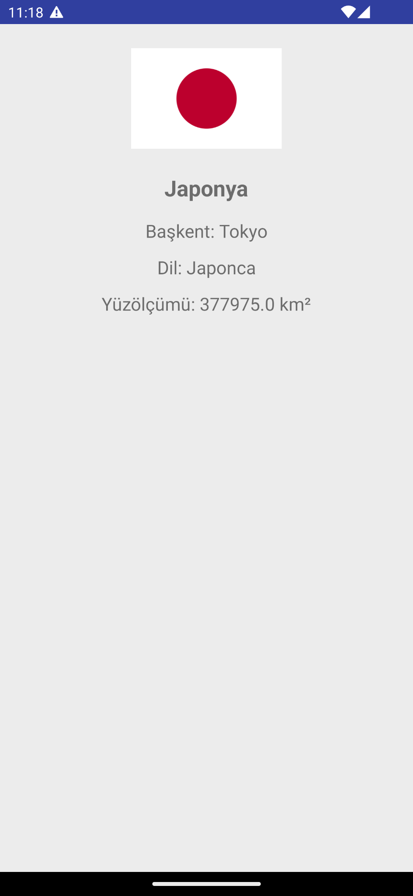
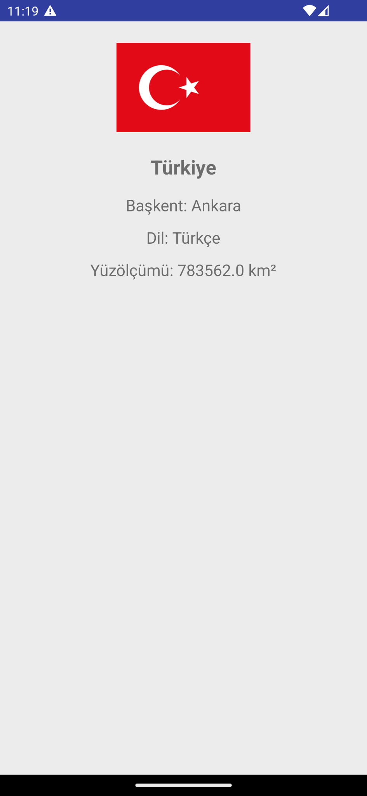
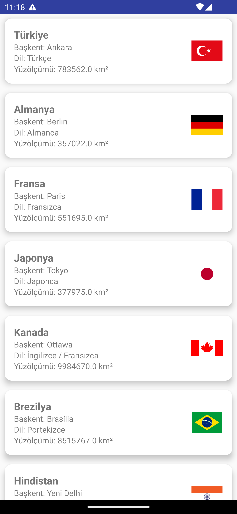
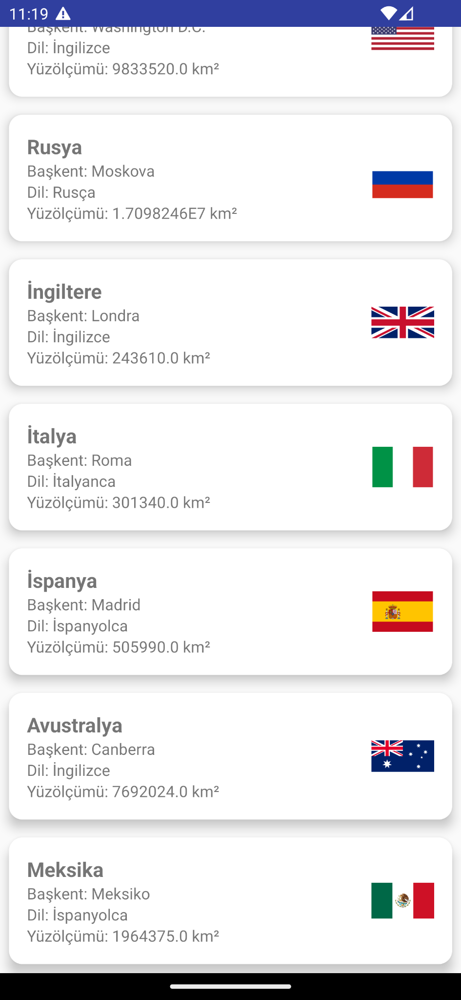
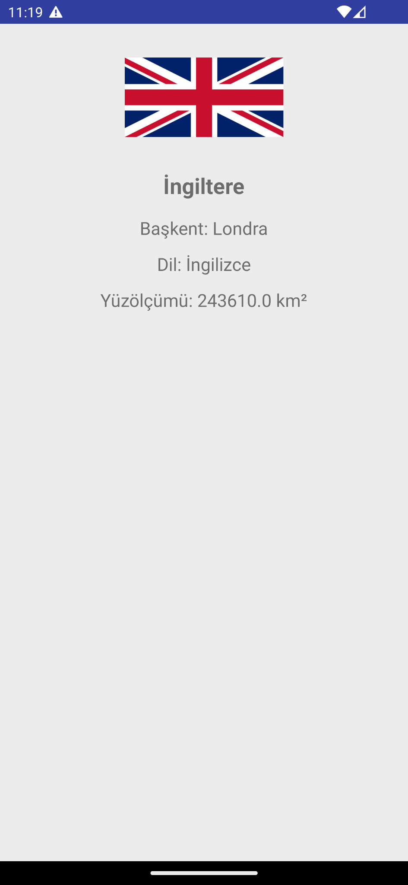

# 🌍 Countries Explorer App

Explore countries, their capitals, languages, and flags in a simple and modern Android app! 🇺🇳✨

---

## ✨ Features

- 🌐 Loads flag images dynamically using Glide
- 📄 Local JSON parsing with Gson
- 💬 Displays country name, capital, spoken language, and area
- 📱 Compatible with Android 7.0+ (API 24+)
- 📦 Written in Kotlin with ViewBinding & Parcelable

---

## 📸 Screenshots

<table>
  <tr>
    <td align="center">
      <b>Main Screen</b><br>
      
    </td>
    <td align="center">
      <b>Main Screen (Scroll)</b><br>
      
    </td>
  </tr>
  <tr>
    <td align="center">
      <b>Detail: Japan</b><br>
      
    </td>
    <td align="center">
      <b>Detail: Turkey</b><br>
      
    </td>
  </tr>
  <tr>
    <td align="center" colspan="2">
      <b>Detail: United Kingdom</b><br>
      
    </td>
  </tr>
</table>


---

## 📂 JSON Sample

```json
{
  "adi": "Japonya",
  "baskent": "Tokyo",
  "yuzolcumu": 377975.0,
  "dil": "Japonca",
  "bayrakKodu": "jp"
}
```

---

## 🚀 Tech Stack

- Kotlin 🟣
- ViewBinding 🧩
- Glide 📷
- Gson 🔄

---

## 🧪 How to Use

1. Clone the repo
2. Open with Android Studio
3. Make sure internet permission is enabled:

```xml

<uses-permission android:name="android.permission.INTERNET" />
```

4. Run on a device or emulator

---

## 🧡 Author

Built with 💚 by [@halilozel1903](https://github.com/halilozel1903)

---